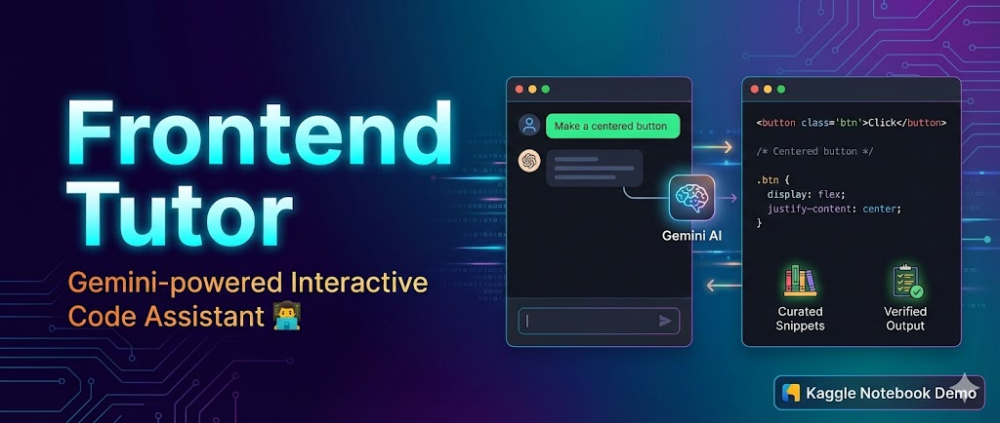

<div align="center">



<br/>

# 🎨 Frontend Tutor Agent

### *An AI Agent to solve all your frontend queries*

<br/>

[](https://python.org)
[](https://deepmind.google/technologies/gemini/)
[](https://google.github.io/adk-docs/)
[](https://github.com/facebookresearch/faiss)
[](https://kaggle.com)

<br/>

> **🏆 Google × Kaggle 5-Day AI Agents Intensive — Capstone Project**

<br/>

</div>

---

## 🌟 The Problem

Learning frontend development is **overwhelming for beginners**. Even seemingly simple tasks like centering a `div` or building a responsive layout require juggling multiple HTML and CSS concepts simultaneously.

Beginners face:

- 🔁 **Inconsistent** explanations scattered across tutorials
- 🗓️ **Outdated** layout patterns that no longer reflect best practices
- 📚 **Overly verbose** examples that obscure the core concept
- ❌ **No validation** — broken code can still *appear* to work
- 🤔 **Translation gaps** — turning plain English questions into working code

The result? Frustration. Slow learning curves. Discouragement.

What beginners really need is a tutor that *thinks*, *checks its own work*, and delivers **clean, correct, minimal code** — every time.

---

## 💡 Why an Agent?

A static chatbot just generates text. **An agent reasons, retrieves, validates, and self-corrects.**

| Capability | What It Does |
|---|---|
| 🔍 **Tool-Calling** | Retrieves known-good HTML/CSS snippets from a curated corpus — no hallucination |
| ✅ **Validation** | Checks generated code for correct layout patterns before returning it |
| 🔄 **Orchestration** | Auto-retries on validation failure — no manual re-prompting |
| 🧠 **Memory** | Stores interaction history for better long-term UX |
| 🔎 **Transparency** | Debug traces expose the full reasoning chain |

This mirrors how a **real tutor** actually works: *reference materials → validate → refine → deliver.*

---

## 🏗️ Architecture

```
┌─────────────────────────────────────────────────────────────────┐
│                        USER QUESTION                            │
│            "How do I center a div with CSS?"                    │
└─────────────────────┬───────────────────────────────────────────┘
                      │
                      ▼
┌─────────────────────────────────────────────────────────────────┐
│                  1. GROUNDING LAYER                             │
│     Snippet Corpus → SentenceTransformer → FAISS Index          │
│      (Canonical HTML/CSS examples, indexed for similarity)      │
└─────────────────────┬───────────────────────────────────────────┘
                      │
                      ▼
┌─────────────────────────────────────────────────────────────────┐
│                    2. TOOLS LAYER                               │
│   ✔ retrieve_snippets    ✔ heuristic_validate                   │
│   (Fetch relevant        (Check for flex/grid/absolute          │
│    grounded examples)     centering patterns)                   │
└─────────────────────┬───────────────────────────────────────────┘
                      │
                      ▼
┌─────────────────────────────────────────────────────────────────┐
│                    3. AGENT LAYER                               │
│         Gemini 2.5 Flash Lite + Google ADK LlmAgent             │
│    (Structured instructions, tool-calling, strict output fmt)   │
└─────────────────────┬───────────────────────────────────────────┘
                      │
                      ▼
┌─────────────────────────────────────────────────────────────────┐
│                4. ORCHESTRATION LAYER                           │
│             Regenerate-on-Fail Retry Loop                       │
│    Run → Read Debug Traces → Detect Validator → Retry if Fail   │
└─────────────────────┬───────────────────────────────────────────┘
                      │
                      ▼
┌─────────────────────────────────────────────────────────────────┐
│                    5. UX LAYER                                  │
│         Session Memory + Inline HTML/CSS Preview                │
│           (See your layout rendered instantly)                  │
└─────────────────────────────────────────────────────────────────┘
```

---

## 🚀 Demo Flow

Here's what happens when you ask **"How do I center a child div inside a parent using CSS?"**

```
1. 🔍  Agent retrieves 2–3 grounded snippets from the corpus

2. ✍️  Gemini generates minimal HTML/CSS using modern layout (flex / absolute)

3. ✅  heuristic_validate() checks the output:
       └─ Valid centering pattern found?
           ├─ YES → Return to user ✅
           └─ NO  → Retry automatically 🔄

4. 👁️  Inline HTML preview renders the final layout visually

5. 💬  User receives:
       ├─ Clean HTML block (with comments)
       ├─ Clean CSS block (with comments)
       └─ A working visual preview — no prose fluff
```

---

## 🛠️ Tech Stack

| Component | Technology |
|---|---|
| **LLM** | Gemini 2.5 Flash Lite |
| **Agent Framework** | Google ADK (`LlmAgent`, `FunctionTool`, `InMemoryRunner`) |
| **Embeddings** | SentenceTransformer (lightweight) |
| **Vector Search** | FAISS `IndexFlatIP` |
| **Validation** | Custom heuristic pattern checker |
| **Notebook** | Jupyter / Kaggle Notebook |
| **Preview** | Inline HTML rendering |

---

## 📁 Project Structure

```
frontend-tutor-agent/
│
├── 📓 frontend-tutor-code-assistant.ipynb   # Main Kaggle notebook
├── 🖼️  frontend-tutor-banner.jpg            # Project banner
└── 📄 README.md                             # You are here
```

---

## 🔬 Google × Kaggle AI Agents Intensive — Concepts Applied

This project directly applies concepts from all 5 days of the intensive:

- **Day 1** — Prompting & Structured Output (strict HTML/CSS-only format)
- **Day 2** — Embeddings & Vector Search (FAISS + SentenceTransformer grounding)
- **Day 3** — Agents & Tool Use (ADK `FunctionTool`, retrieval + validation tools)
- **Day 4** — Domain-Specific Agents (education-focused tutor persona)
- **Day 5** — Agent Orchestration (regenerate-on-fail retry loop, debug traces)

---

## 🔮 Future Enhancements

<details>
<summary><strong>Click to expand the roadmap</strong></summary>

<br/>

| Feature | Description |
|---|---|
| 🎭 **Visual DOM Validator** | Use Playwright/headless browser for pixel-accurate layout verification |
| 📦 **Larger Snippet Corpus** | Animations, navbars, cards, tabs, dark/light theming |
| 🧠 **User Preference Learning** | Remember if a user prefers `grid` over `flex`, `rem` over `px`, etc. |
| 📖 **Multi-Step Tutorials** | Step-by-step walkthroughs explaining *why* the code works |
| 🚀 **CodeSandbox Export** | One-click live editing in browser |
| 🌐 **Web App Deployment** | Full UI-powered frontend learning assistant |

</details>

---

## 📓 Notebook

Open the capstone notebook directly:

[](frontend-tutor-code-assistant.ipynb)

---

<div align="center">

<br/>

Built with ❤️ for the **Google × Kaggle 5-Day AI Agents Intensive**

*Capstone Project — Agents Intensive*

<br/>

*If this project helped you, consider leaving a ⭐ on the repo!*

</div>
